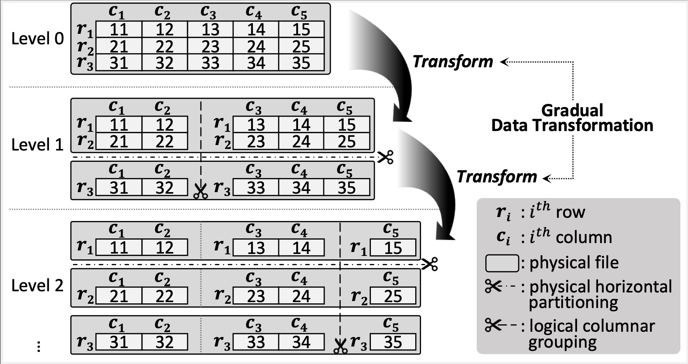

*LOCATOR*
=======

*LOCATOR* is a log-structured data transformation framework designed to enhance standalone databases with Hybrid Transactional/Analytical Processing (HTAP) workloads.
Unlike conventional ETL processes that can be resource-intensive and affect data freshness, *LOCATOR* incorporates a novel physical layout with real-time data reformatting.
It uses a level-structured approach with gradual data transformation and ensures instant data access through a *route synopsis* that predicts future data locations.
We make the following concepts in *LOCATOR*.

**Core Concepts Underpinning *LOCATOR***

- *LOCATOR* is a data transformation framework that targets the challenges of traditional ETL processes in standalone HTAP database systems.
- *LOCATOR* employs a level-structured approach with gradually finer-grained partitioning for data transformation, minimizing I/O amplification.
- *LOCATOR* allows workers to access data instantly and to update through *route synopsis* during reformatting.
- *LOCATOR*'s in-place update strategy, combined with out-of-place inserts, addresses the challenges of multi-version concurrency control.

This document serves as a comprehensive guide to understanding *LOCATOR*'s underlying logic and its implementation at the code level. It also provides detailed instructions on how to reproduce evaluations using the prepared scripts.

# Log-structured Data Transformation

*LOCATOR* implements a log-structured approach to data transformation, where data is incrementally transformed from low-dimensional partitions to high-dimensional ones.
The following figure shows our gradual data transformation concept well.



*LOCATOR* consists of multi-level partitions resembling LSM trees, where a paginated file represents each partition.
*LOCATOR*'s partitioning workers are dedicated to gradual data transformation.
They check partition files to see whether a partition file exceeds the threshold.
If the partition's record count exceeds the threshold, the partitioning worker distributes the partition's records to finer-grained subpartitions in order.

## LocatorRepartitioning

```{r, tidy=FALSE, eval=FALSE, highlight=FALSE }
// postgres/src/backend/locator/partitioning/locator_partitioning.c

FUNCTION LocatorRepartitioning ()
    WHILE TRUE:
        // Get a record from the target partition.
        record = LocatorGetRecordFromPartitions()

        // When there are no records left to distribute, it's done.
        IF record == NULL THEN
            RETURN
        ENDIF

        // We append the record to a lower partition following a data layout.
        LocatorPartitionAppend(record)
    END WHILE
END FUNCTION
```

Following the pseudocode, the partitioning worker's record distribution is divided into two steps.
First, it retrieves a record from the target partition in a sequential manner.
Then, the partitioning worker appends the record to the lower partition in a deterministic manner, using the *route synopsis* to precisely determine the record's location.
The LocatorRepartitioning function serves as the main entry point for the repartitioning job.
For a more detailed understanding, we recommend exploring the LocatorRepartitioning function in the locator_repartitioning.c file.

## LocatorGetRecordFromPartitions

```{r, tidy=FALSE, eval=FALSE, highlight=FALSE }
// postgres/src/backend/locator/partitioning/locator_partitioning.c

FUNCTION LocatorGetRecordFromPartitions ()
    WHILE TRUE:
        // Get a record from the target partition.
        record = LocatorPartitionGetRecord()

        // If the layout needs to be changed, reformat the record. (columnar grouping)
        IF record != NULL THEN
            IF layoutNeedsToBeChanged THEN
                LocatorReformatLocatorRecord(record)
            END IF

            RETURN record
        ELSE
            RETURN NULL
        END IF

    END WHILE
END FUNCTION
```

When the partitioning worker retrieves a record, if columnar grouping is required, it reformats the record according to the layout described in the external catalog.
The layout is set by the locator_set_columnar_layout().
For a more detailed understanding, we recommend exploring the LocatorGetRecordFromPartitions function in the locator_external_catalog.c file.

## LocatorPartitionAppend

```{r, tidy=FALSE, eval=FALSE, highlight=FALSE }
// postgres/src/backend/locator/partitioning/locator_partitioning.c

FUNCTION LocatorPartitionAppend (record)
    // Get partition key from record.
    partitionKey = record.partitionKey

    // Get the target partition of this record
    // by using fixed-fanout, partition key and partition level. (KIV-1)
    targetPartitionNumber = GetPartitionNumberFromPartitionKey(fanout, partitionKey, level)

    // Get private buffer of partitioning worker for the partition.
    privateBuffer = LocatorPartitionGetPrivateBufferForTuple(targetPartitionNumber)

    // Append attributes of the record to each column zone. (KIV-2)
    FOR i = 0 TO column group count
        IF i == 0 THEN
            LocatorPartitionPageAddSiroTuple(privateBuffer, record)
        ELSE
            LocatorPartitionPageColumnarTuple(privateBuffer, record)
        END IF
    END FOR
END FUNCTION
```

When the partitioning worker distributes records, it follows two key invariants.
First, it selects the target partition deterministically using fixed-fanout, partition key of the record and partitioning level. **(KIV-1)**
Then, it preserves order by always appending the record to the target partition. **(KIV-2)**
The 0th column group allows updates, and any record not columnar grouped is appended to the 0th column zone to maintain a row-oriented format.

# TANDEM: Tuple Location Discovery

*LOCATOR* gradually changes the position of data, making it difficult to pinpoint the location of data during scan. We use *Route Synopsis* which allows us to specify the exact location of data at the current moment. The *Route Synopsis* tells us three information: level, partition number, and page number.

```
// postgres/src/backend/access/heap/heapam.c file.

FUNCTION locator_insert()
    ex_catalog = LocatorGetExternalCatalog(relid)

    locator_route_synopsis->rec_key.seqnum = ex_catalog->seqnum++;

    ...
END FUNCTION

FUNCTION LocatorRouteSynopsisGetTuplePositionForIndexscan() 
    ...

    seqnum = route_synopsis->rec_key.seqnum

    FOR level = 0 TO max_level:
        level_info = ex_catalog[level]
        IF seqnum >= level_info->first_seq_number THEN
            BREAK
        ENDIF
    END FOR

    ...
END FUNCTION
```
*LOCATOR* increments the sequence number of the ex-catalog by 1 when every new tuple is inserted. The sequence number is used to specify the current level of data during the index scan. The above pseudocode outlines these with two functions.

```
// postgres/src/backend/executor/nodeModifyTable.c

FUNCTION HapExecInsert()
    ...

    HapExecForeignKeyCheckTriggers() // foreign key check to parent table's tuples

    HapBuildHiddenAttr() // combine the parent hidden attributes

    partid = HapGetPartIdHash() // find partition id using combined hidden attribute

    table_tuple_insert() // locator_insert()

    ExecInsertIndexTuple() // index tuple insert

    ...
END FUNCTION
```
*LOCATOR* uses foreign key relationship for horizontal partitioning. The relationship is implied in *hidden attribute*, managed by a module called *HAP*. This module manages all possible combinations of hidden attribute and assigns a partition ID to each one. The provided pseudocode illustrates functions for obtaining hidden attribute and converting it into partition ID. As mentioned in the paper, knowing the fanout and partition ID allows us to determine which partition to access at each level.

```
// postgres/src/backend/access/heap/heapam.c

FUNCTION locator_insert()
    ...

    FOR level = 0 TO max_level:
        locator_route_synopsis->rec_pos.in_partition_count[level].cumulative_count
            = ex_catalog->internalCumulativeCount[level][partnum].cumulative_count++
    END FOR

    ...
END FUNCTION


FUNCTION LocatorRouteSynopsisGetTuplePositionForIndexscan()
    ...

    tuplePosition->partitionTuplePosition
        = routeSynopsis->rec_pos.in_partition_count[level].cumulative_count - locationInfos[level].reorganizedRecordsCount

    ...
END FUNCTION
```
A new tuple knows which partitions it will passes through at each level. The locator_insert() increments the cumulative_count to reserve the location of the new tuple on these partitions. When searching for this tuple, the tuple position within the partition is calculated based on the cumulative count range of the partition to be read at the current moment.

# How to Reproduce Evaluations with Prepared Scripts

## Information

- Evaluation setup of *LOCATOR* paper:
	- CPU: Dual AMD EPYC 7742
	- RAM: 512 GiB
	- Device: Two 2 TiB PCIe 4.0 NVMe SSDs, (each delivering 7 GiB/s for sequential reads, RAID 0)
- Hierarchy
	```
	LOCATOR
	├── chbenchmark: codes of CH-benCHmark
	├── PostgreSQL
	│   ├── postgres: source codes
	│   └── scripts: install, init, run, shutdown server
	└── evaluation: scripts for evaluation
	```
- CH-benCHmark modification
	- To see what *LOCATOR* modified the chbenchmark for evaluation, search **pgoltp.tcl** for **"Edited by LOCATOR"**. (LOCATOR/chbenchmark/HammerDB-4.3/src/postgresql/pgoltp.tcl)

## Preparation for evaluation

The *LOCATOR* is evaluated by running the python scripts(CH_OLAP.py, CH_OLTP.py, CH_HTAP.py).

- Configure
    - The PostgreSQL requires initial configure.
        ```
        cd PostgreSQL/postgres
        ./configure
        ```
- Dropping cache
	- The python scripts drop cache by executing ```drop_cache```.
	- Set the owner of ```drop_cache``` to root and uid.
        ```
        cd evaluation
        sudo chown root:root drop_cache
        sudo chmod u+s drop_cache
        ```

## Run evaluation

- Run the below script to build dataset and run evaluation.
	```
	cd evaluation/CH_benCHmark
    ./run.sh ${BUILD_WORKERS} ${LOCATOR_PATH} ${DATA_PATH}
    # e.g., ./run.sh 100 /home/user/LOCATOR /opt/md0/user/data
	```
